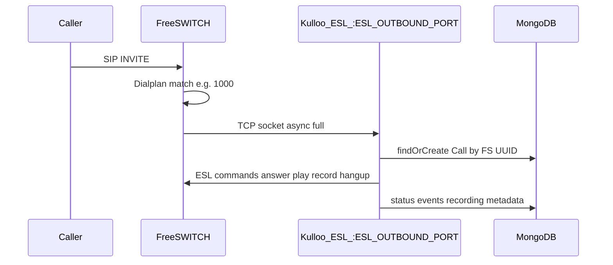
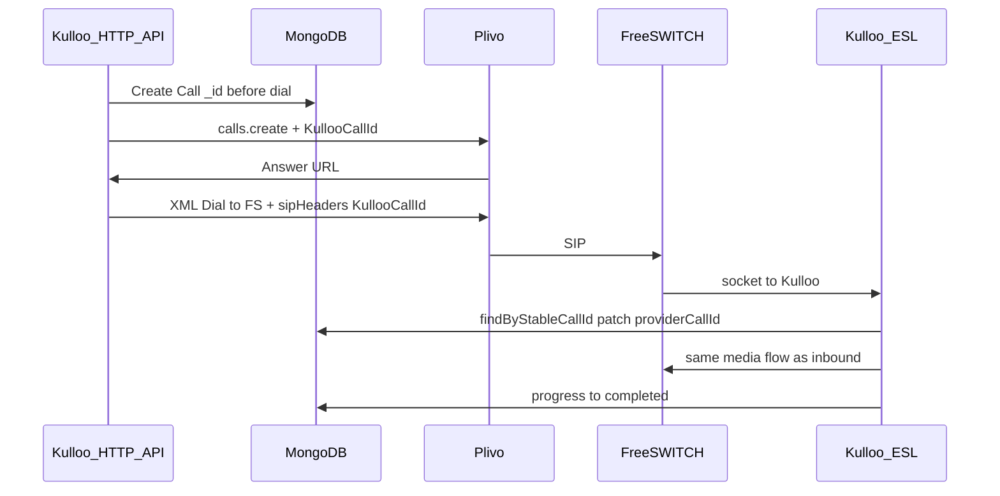

# ESL (Event Socket) in Kulloo

This document explains **what ESL is**, **how Kulloo uses it**, and the **data flow** from FreeSWITCH to the Node backend and MongoDB. It is a conceptual guide; implementation details live in the source files referenced below.

---

## 1. What is ESL?

**ESL** (Event Socket Layer) is FreeSWITCH’s mechanism for **external applications** to control a call **in real time**: answer, play audio, record, detect DTMF, hang up, and subscribe to channel events.

- Communication is typically **TCP**, using a text protocol (commands and event payloads).
- The **Kulloo** backend uses the **`modesl`** npm package (`Server` + per-connection `Connection`) to accept ESL traffic and send commands.

ESL is **not** SIP; SIP is handled by FreeSWITCH (e.g. Sofia). ESL is the **control plane** for the media leg once the call exists inside FreeSWITCH.

---

## 2. Two different “directions” (do not confuse them)

| Pattern | Who connects to whom | Typical port | Role in Kulloo |
|--------|----------------------|----------------|----------------|
| **Inbound ESL (classic)** | A **client** (script, bot, operator tool) connects **to** FreeSWITCH | FreeSWITCH listens (often **8021**, password `ClueCon` in sample configs) | **Optional / not required** for the hello flow. Your `freeswitch.xml` may still load `mod_event_socket` for tools that connect **to** FS. |
| **Outbound ESL (“socket” app)** | FreeSWITCH runs the dialplan application **`socket`** and opens a connection **to** your app | Your app listens on **`ESL_OUTBOUND_PORT`** (default **3200**) | **This is what Kulloo uses** for the hello call script. |

In logs and docs, “**outbound ESL**” means: **FreeSWITCH → Kulloo** (TCP into Node). From Node’s perspective it is an **inbound TCP server** that accepts FS.

---

## 3. How Kulloo uses ESL

1. **`server.ts`** starts **`EslCallHandlerService.listen()`** on **`ESL_OUTBOUND_PORT`** (env, default **3200**).
2. FreeSWITCH dialplan hits an extension (e.g. destination `1000` or `hello`) and runs **`socket host:port async full`** (see [`freeswitch/conf/dialplan/hello.xml`](../freeswitch/conf/dialplan/hello.xml)).
3. For each new call, FreeSWITCH opens **one TCP connection** to Kulloo; **`esl-call-handler.service.ts`** handles it end-to-end.
4. The handler:
   - Parses **channel UUID**, **caller/callee** (headers and `getvar` fallbacks).
   - Optionally reads **`KullooCallId`** (24-char hex = Mongo `Call._id`) from SIP/channel variables to **attach** an API-created outbound call.
   - Otherwise **creates or finds** a `Call` in Mongo by FreeSWITCH UUID (**inbound** path).
   - Runs **`executeCallFlow`**: answer → short sleep → tone → `record_session` → DTMF “1” or timeout → stop record → hangup → update **`Call`**, **`CallEvent`**, **`Recording`**.
5. WAV files are written under **`RECORDINGS_DIR`** (e.g. `{channelUuid}.wav`), aligned with what the API exposes for local playback.

So: **ESL is how Kulloo drives media and persistence** for the hello flow after SIP has landed on FreeSWITCH.

---

## 4. Data flow (high level)

### 4.1 Inbound DID or direct SIP to FreeSWITCH

### 4.2 Outbound API → Plivo → FreeSWITCH → ESL

The stable id **`KullooCallId`** ties the **pre-created** `Call` row to the **FreeSWITCH channel** so you do not split one logical call into two Mongo documents.

---

## 5. Correlation: `KullooCallId`

- **Canonical id:** Mongo **`Call._id`** as 24-character hex (also exposed as **`callSid`** in JSON).
- **On SIP:** Custom header **`KullooCallId`** (Plivo may surface it as **`X-PH-KullooCallId`** on HTTP callbacks).
- **In ESL:** Parsed from channel headers/variables; if it matches an existing `Call`, ESL **updates** that document with the real **FreeSWITCH channel UUID** as `providerCallId` and keeps **`direction: outbound`**.

If **`KullooCallId` is missing** (pure inbound DID), ESL creates an **inbound** `Call` keyed by the FS UUID.

---

## 6. What the hello ESL flow does (summary)

Rough order inside **`executeCallFlow`** (see [`esl-call-handler.service.ts`](../backend/src/services/freeswitch/esl-call-handler.service.ts)):

1. Resolve/create **`Call`** and emit **`received`** when new.
2. **`answer`**
3. Short **`sleep`**
4. **`playback`** (tone)
5. **`recording_started`** + create/update **`Recording`** row **pending**
6. **`record_session`** to `{RECORDINGS_DIR}/{uuid}.wav`
7. Wait for **DTMF 1** (early stop) or **sleep** up to ~20s
8. **`stop_record_session`**
9. **`handleRecordingComplete`** (file stat, mark recording **completed** / events)
10. Optional confirm tone if DTMF 1
11. **`hangup`**, then **`completed`** on the call

Failures go through **`failAndHangup`** (status **failed**, metrics, best-effort hangup).

---

## 7. Environment and ports

| Variable | Meaning |
|----------|---------|
| `ESL_OUTBOUND_PORT` | TCP port Kulloo **listens on** for FreeSWITCH `socket` (default **3200**). |
| `RECORDINGS_DIR` | Directory for WAV files (must match shared volume with FS in production). |
| `FREESWITCH_ESL_*` | Refer to the **classic** ESL **server inside FS** (8021); **not** the same as Kulloo’s outbound listener unless you add a separate client—**not required** for the hello `socket` path. |

Firewall: allow **TCP** from the FreeSWITCH host to **`ESL_OUTBOUND_PORT`** on the Kulloo host.

---

## 8. Observability

- Structured logs with **`component: esl`**, **`callId`**, **`callSid`**, **`channelUuid`**, **`correlationId`** (from the `Call` document when known).
- **`GET /api/metrics`**: `activeCalls`, `failedCalls`, `recordingFailed`, `dtmfCount` (incremented inside the ESL handler where applicable).

---

## 9. Source file map

| Topic | Path |
|--------|------|
| ESL TCP server + call flow | [`backend/src/services/freeswitch/esl-call-handler.service.ts`](../backend/src/services/freeswitch/esl-call-handler.service.ts) |
| Process bootstrap (ESL + HTTP) | [`backend/src/server.ts`](../backend/src/server.ts) |
| Call / event / recording persistence | [`backend/src/modules/calls/services/call.service.ts`](../backend/src/modules/calls/services/call.service.ts) |
| FreeSWITCH `socket` dialplan | [`freeswitch/conf/dialplan/hello.xml`](../freeswitch/conf/dialplan/hello.xml) |

---

## 10. Related documentation

- [`freeswitch.md`](./freeswitch.md) — FreeSWITCH config, `socket` vs ESL port 8021, Docker.
- [`inbound-call-dataflow.md`](./inbound-call-dataflow.md) — Inbound DID → Answer URL → FS → ESL.
- [`outbound-calls.md`](./outbound-calls.md) — Outbound API, Plivo, `KullooCallId`, ESL attach.
- [`hello-call-contract.md`](./hello-call-contract.md) — Hello contract and acceptance notes.

---

*Kulloo ESL: FreeSWITCH outbound Event Socket to Node on `ESL_OUTBOUND_PORT`, full programmatic hello flow, MongoDB as system of record.*
