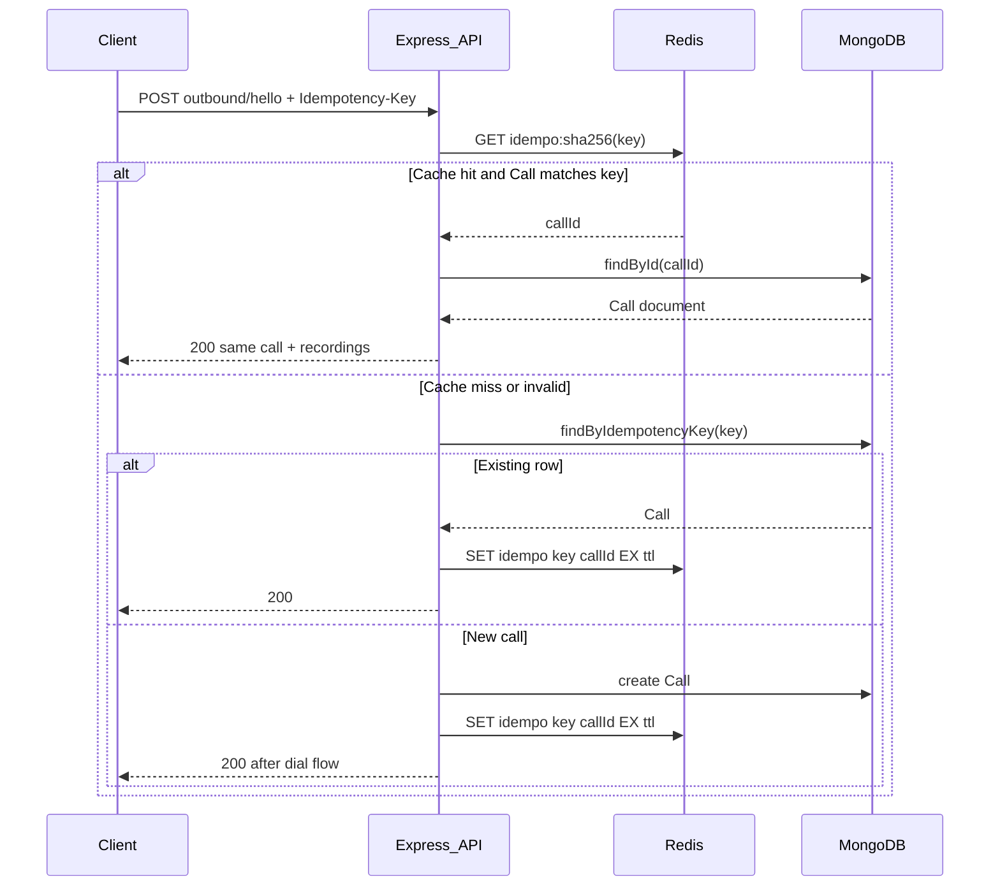
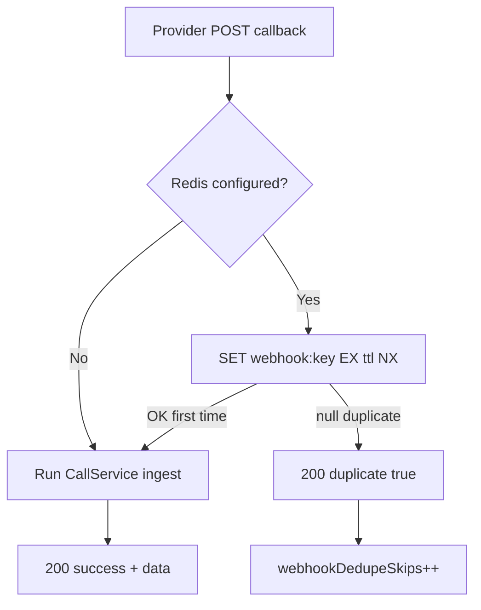

# Redis in Kulloo

Redis is an **optional** layer in front of **MongoDB**. It does **not** replace Mongo as the system of record for calls, events, or recordings. When `REDIS_URL` is unset, the API behaves as before: Mongo enforces outbound idempotency (unique `idempotencyKey` index), and recording webhooks rely on Mongo upserts.

This document describes **why** Redis is used, **how** keys and TTLs work, **data flows**, and where to look in the codebase.

---

## 1. What Redis is used for

| Feature | Purpose | Mongo role without Redis |
|--------|---------|---------------------------|
| **Idempotency cache** | Faster repeat `POST /api/calls/outbound/hello` with the same `Idempotency-Key`: cache maps key → Mongo `Call._id` to skip an extra `findByIdempotencyKey` read when possible. | Same idempotency, always via Mongo lookup. |
| **Recording webhook dedupe** | If Twilio / Plivo / FreeSWITCH **retries** the same recording callback, `SET … NX` ensures the handler runs **once** per logical event; duplicates get **200** + `{ duplicate: true }` without double work. | Upserts may still converge; duplicate events / side effects possible. |
| **Readiness** | `GET /api/health` can require Redis to answer `PING` when `REDIS_URL` is set. | N/A |
| **Metrics** | Counters for cache hits/misses and webhook skip count. | Counters stay at 0 for Redis fields. |

---

## 2. Configuration

| Variable | Meaning |
|----------|---------|
| `REDIS_URL` | Single connection string, e.g. `redis://localhost:6379` or `redis://redis:6379` inside Docker. **If unset**, Redis features are disabled. |
| `REDIS_KEY_PREFIX` | Prefix for all keys (default `kulloo:`) so a shared Redis instance can host multiple apps. |
| `REDIS_IDEMPOTENCY_TTL_SEC` | Expiry for idempotency cache entries (default **86400** = 24h). |
| `REDIS_WEBHOOK_DEDUPE_TTL_SEC` | Expiry for webhook dedupe keys (default **172800** = 48h). |

Passwords and TLS are supported via standard Redis URLs (e.g. `rediss://` for TLS) as supported by **ioredis**.

---

## 3. Code layout

| Path | Role |
|------|------|
| [`backend/src/config/env.ts`](../backend/src/config/env.ts) | Reads `REDIS_*` env; `isRedisConfigured()`. |
| [`backend/src/services/redis/redis.client.ts`](../backend/src/services/redis/redis.client.ts) | Singleton **ioredis** client, `pingRedis()`, `disconnectRedis()` (SIGTERM/SIGINT in `server.ts`). |
| [`backend/src/services/redis/idempotency-cache.service.ts`](../backend/src/services/redis/idempotency-cache.service.ts) | SHA-256 of `Idempotency-Key` → key `…idempo:<hex>`; `GET` / `SET` with TTL. |
| [`backend/src/services/redis/webhook-dedupe.service.ts`](../backend/src/services/redis/webhook-dedupe.service.ts) | `SET key 1 EX ttl NX` per webhook identity. |
| [`backend/src/modules/calls/services/call.service.ts`](../backend/src/modules/calls/services/call.service.ts) | `runOutboundHelloFlow`: cache read before Mongo; `setCachedCallId…` after Mongo hit or after `create`. |
| [`backend/src/modules/calls/controllers/call.controller.ts`](../backend/src/modules/calls/controllers/call.controller.ts) | Recording callbacks call `claimRecordingWebhookOnce` before ingestion. |
| [`backend/src/routes/health.routes.ts`](../backend/src/routes/health.routes.ts) | Redis `PING` when configured. |
| [`backend/src/services/observability/metrics.service.ts`](../backend/src/services/observability/metrics.service.ts) | `redisIdempotencyHits`, `redisIdempotencyMisses`, `webhookDedupeSkips`. |

---

## 4. Key shapes (logical)

All keys are prefixed with `REDIS_KEY_PREFIX` (default `kulloo:`).

| Pattern | Example | TTL |
|---------|---------|-----|
| Idempotency cache | `kulloo:idempo:<sha256(Idempotency-Key)>` | `REDIS_IDEMPOTENCY_TTL_SEC` |
| Twilio webhook | `kulloo:webhook:twilio:<encoded(CallSid)>:<encoded(RecordingSid)>` | `REDIS_WEBHOOK_DEDUPE_TTL_SEC` |
| Plivo webhook | `kulloo:webhook:plivo:<encoded(callUuid)>:<encoded(RecordingID)>` | same |
| FreeSWITCH webhook | `kulloo:webhook:freeswitch:<encoded(callUuid)>` | same |

Webhook segments are `encodeURIComponent`’d and joined with `:` to avoid delimiter collisions in values.

---

## 5. Data flow: outbound hello + idempotency cache

Mongo remains authoritative: the unique index on `idempotencyKey` still prevents duplicate calls if Redis is cold or evicted.

**Metrics:** `redisIdempotencyHits` when a repeat request is satisfied from cache + Mongo; `redisIdempotencyMisses` once per request when Redis is configured and the cache path did not return a usable hit (including first-time keys).

---

## 6. Data flow: recording webhooks (dedupe)

- **Twilio:** identity = `CallSid` + `RecordingSid`.
- **Plivo:** identity = query `callUuid` + body `RecordingID`.
- **FreeSWITCH:** identity = body `callUuid`.

Duplicate responses are still **HTTP 200** so providers stop retrying; they are **not** a substitute for verifying webhook authenticity (signatures, IP allowlists, etc.).

---

## 7. Health and process lifecycle

- **`GET /api/health`**: If `REDIS_URL` is set, `checks.redis` includes `configured: true` and a `PING`. Failure → overall readiness **503** (strict: Redis is required when enabled).
- **Shutdown:** `server.ts` registers `disconnectRedis()` on **SIGTERM** / **SIGINT** so the ioredis connection closes cleanly.

---

## 8. Docker and local development

| Compose file | Redis |
|--------------|--------|
| [`docker-compose.yml`](../docker-compose.yml) | `redis` service, host port **6379**. |
| [`docker-compose.server.yml`](../docker-compose.server.yml) | `redis` + `REDIS_URL=redis://redis:6379` on `api`. |
| [`docker-compose.redis.yml`](../docker-compose.redis.yml) | Redis-only stack for local use. |

Use **`redis://localhost:6379`** from the host when only the standalone Redis compose is running.

**Port conflict:** Only one process should bind host **6379** at a time, or change the published port and adjust `REDIS_URL`.

---

## 9. Operational checklist

- Set **`REDIS_URL`** wherever you want cache + dedupe; omit it to disable Redis entirely.
- Monitor **`GET /api/metrics`** for hit/miss/skip rates after traffic.
- Rely on **TTLs** so memory stays bounded; treat Redis as **best-effort** cache—Mongo indexes backstop idempotency.
- For production Redis exposed beyond localhost, use **password**, **network ACLs**, and **TLS** as appropriate.

---

## 10. Related documentation

- [api.md](./api.md) — HTTP surface, health, metrics.
- [stability.md](./stability.md) — Broader reliability notes (signatures, ESL, etc.).

---

*Redis integration: optional cache and webhook dedupe; MongoDB remains the source of truth for call state.*
