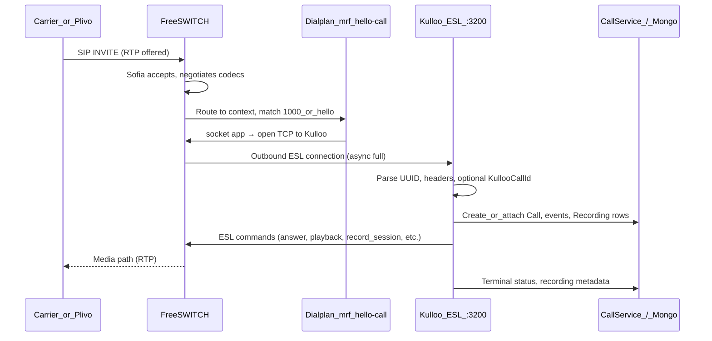

# FreeSWITCH in Kulloo

> **Doc hub:** [Documentation index](../README.md) — ESL and call flows are in the other `doc/telephony/` files.

This document describes **what FreeSWITCH does** in this project, **how the checked-in configuration is structured**, and the **end-to-end data flow** from SIP/RTP through FreeSWITCH to the Kulloo backend (MongoDB, recordings). It matches the files under `freeswitch/conf/` and the backend ESL handler in `backend/src/services/freeswitch/esl-call-handler.service.ts`.

---

## 1. Role in the architecture

| Piece | Responsibility |
|--------|----------------|
| **FreeSWITCH** | SIP termination, RTP/media, codec handling, executing the dialplan step that **hands the call to Kulloo** via the `socket` application. |
| **Kulloo Node (ESL)** | Listens on **`ESL_OUTBOUND_PORT`** (default **3200**). Accepts the **outbound** Event Socket connection from FreeSWITCH, then runs the hello flow: answer → tone → record → DTMF → hangup, and persists `Call` / `CallEvent` / `Recording` in MongoDB. |
| **MongoDB** | System of record for call state (see [inbound-call-dataflow.md](./inbound-call-dataflow.md), [outbound-calls.md](./outbound-calls.md)). |

Recording WAV files are typically written to a directory shared with the backend (`RECORDINGS_DIR`), so the API can list and stream them.

---

## 2. Repository layout

```
freeswitch/
  conf/
    dialplan/hello.xml   # Hello extension: socket → Kulloo ESL
    freeswitch.xml       # Modules, Sofia, event_socket, dialplan include
    vars.xml             # external_sip_ip, codecs, RTP range, optional webhook var
```

Docker may mount these in different ways (see §7).

---

## 3. Configuration files (what each one does)

### 3.1 `conf/dialplan/hello.xml`

Defines a single dialplan **context** named **`mrf`** and one extension **`hello-call`**:

- **Match:** `destination_number` matches **`1000`** or **`hello`** (regex `^(1000|hello)$`).
- **Action:** `socket` — FreeSWITCH opens an **outbound** TCP connection to the Kulloo ESL server and transfers session control (async, full event socket mode).

```xml
<action application="socket" data="<kulloo-host>:<esl_port> async full"/>
```

The repository currently points at a concrete host (replace with your backend IP/hostname and port in production). **`async full`** means the socket session runs asynchronously with full ESL semantics for that call leg.

**Important:** Media logic (playback, `record_session`, hangup) is **not** implemented in this XML for the hello path; it runs in **Node** after the socket connects.

### 3.2 `conf/freeswitch.xml`

A bundle of related settings:

1. **Modules** — Loads SIP (`mod_sofia`), XML dialplan (`mod_dialplan_xml`), **`mod_event_socket`** (classic ESL server), tone/recording helpers (`mod_tone_stream`, `mod_sndfile`), etc.

2. **Inbound ESL server (`event_socket.conf` embedded)** — FreeSWITCH listens on **`0.0.0.0:8021`** with password **`ClueCon`**. This is the **classic** pattern: a **client** connects **to** FreeSWITCH on port **8021**. It is **separate** from the dialplan **`socket`** app, which makes FreeSWITCH connect **out** to Kulloo on port **3200**.

3. **Sofia SIP (`internal` profile)** — Binds SIP (typically port **5060**), sets RTP-related external IP from `vars.xml`, and **`auth-calls=false`** so unauthenticated inbound INVITEs (e.g. from a carrier bridge) can be accepted. The profile references a dialplan **context** (see §5 for `mrf` vs `public`).

4. **Dialplan** — Includes `dialplan/hello.xml` so the `hello-call` extension is loaded.

### 3.3 `conf/vars.xml`

- **`external_sip_ip`** — Public IPv4 used in Sofia for correct **Contact** and **RTP** when FreeSWITCH runs behind NAT/Docker.
- **`domain`** — Derived from `external_sip_ip`.
- **`kulloo_recording_webhook_url`** — Optional global variable for a Kulloo HTTP callback endpoint. The hello flow **records and finalizes metadata in Node** (`esl-call-handler.service.ts`); this variable is available if you add dialplan or other FS-side integrations that POST completion to the API.
- **Codecs** — `OPUS,PCMU,PCMA` preferences.
- **RTP range** — `16384`–`16484` (align firewall rules with your deployment).

---

## 4. Two different “ESL” paths (do not confuse them)

| Mechanism | Direction | Port (typical) | Purpose in Kulloo |
|-----------|-----------|------------------|-------------------|
| **`mod_event_socket` server** | Client → FreeSWITCH | **8021** on FS | Optional: tools or services that connect **to** FreeSWITCH with password `ClueCon`. |
| **Dialplan `socket` application** | FreeSWITCH → Kulloo | **3200** on Kulloo (`ESL_OUTBOUND_PORT`) | **Hello path:** FS connects **out** to Node; Node runs `EslCallHandlerService`. |

The production hello flow documented in this repo is centered on the second row: **`socket` → Kulloo:3200**.

---

## 5. Dialplan context: `mrf` and Sofia

- `hello.xml` defines extensions under **`context name="mrf"`**.
- The sample `internal` Sofia profile in `freeswitch.xml` sets **`context` to `public`**.

For the **`hello-call`** extension to run, the **incoming call must enter the `mrf` context** (or you need a matching extension in the context Sofia actually uses). In deployments, either:

- Set the Sofia profile **`context`** to **`mrf`**, or  
- Add routing in **`public`** (or the context you use) that sends `1000` / `hello` into **`mrf`**, or  
- Rely on image-specific defaults (some images merge `mrf.xml` from the container layout).

After changing context, place a test call and confirm in FS logs that the **`hello-call`** extension runs before debugging ESL.

---

## 6. End-to-end data flow

### 6.1 Sequence (typical Plivo → FreeSWITCH → Kulloo)



### 6.2 Logical pipeline

1. **SIP/RTP** — Caller or upstream bridge (e.g. Plivo after Answer URL `<Dial>`) sends INVITE to FreeSWITCH; media is **RTP** between endpoints and FreeSWITCH.
2. **Dialplan** — If the request hits context **`mrf`** and `destination_number` is **`1000`** or **`hello`**, the **`socket`** action runs.
3. **Outbound socket** — FreeSWITCH connects to **Kulloo** at the configured **`host:port`** (ESL outbound listener).
4. **Kulloo** — `EslCallHandlerService` drives the call: correlates with Mongo (`KullooCallId` for outbound API leg, or new inbound `Call` by FS UUID), updates statuses, writes WAV under `RECORDINGS_DIR` / shared volume.

---

## 7. Docker and compose

Paths differ by compose file:

| File | How FreeSWITCH config is supplied |
|------|-------------------------------------|
| **`docker-compose.freeswitch.yml`** | Mounts **`hello.xml`** into the image as **`mrf.xml`** under `/usr/local/freeswitch/conf/dialplan/`. Uses image `freeswitch` command flags for external SIP/RTP IP and RTP range. |
| **`docker-compose.yml`** | Mounts **`./freeswitch/conf`** to **`/etc/freeswitch`** for the whole tree (local dev style). |

Firewall rules must allow **SIP** (typically **5060** TCP/UDP), **RTP** (your `vars.xml` range), and **TCP** from the FreeSWITCH host to **Kulloo’s `ESL_OUTBOUND_PORT`** (e.g. **3200**). The image README / `docker-compose.freeswitch.yml` header lists example ports.

---

## 8. Operational checklist

| Check | Why |
|--------|-----|
| **`socket` host:port** reachable from FS | Otherwise the call fails at dialplan `socket`. |
| **Shared `RECORDINGS_DIR`** | WAVs must be visible to the backend API for listing/streaming. |
| **`FREESWITCH_SIP_URI` in Kulloo** | Plivo (or clients) must dial a user/host that lands in the right **context** and **extension** (e.g. `sip:1000@...`). |
| **Context `mrf` actually used** | Otherwise `hello-call` never runs (§5). |

---

## 9. Related documentation

| Doc | Topic |
|-----|--------|
| [esl.md](./esl.md) | What ESL is, outbound socket vs FS:8021, data flow |
| [inbound-call-dataflow.md](./inbound-call-dataflow.md) | Inbound DID → Answer URL → FS → ESL → Mongo |
| [outbound-calls.md](./outbound-calls.md) | Outbound API → Plivo → FS → ESL, `KullooCallId` |
| [api.md](../reference/api.md) | HTTP routes, callbacks |
| *stability.md* (not in repo yet) | Idempotency, timeouts, recovery — see [Documentation index](../README.md) |

**Backend:** `backend/src/server.ts` (ESL port), `backend/src/services/freeswitch/esl-call-handler.service.ts` (call flow).

---

*Last updated to match `freeswitch/conf/` and Kulloo ESL integration.*
